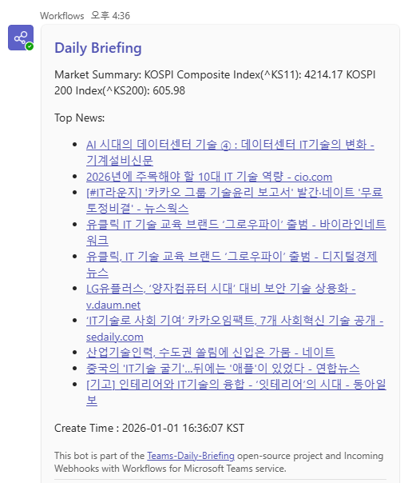

# 📈 Teams Daily Briefing

A serverless Python bot that sends automated stock market briefings (or any custom messages) to a Microsoft Teams channel.

Powered by **GitHub Actions**, it runs on a schedule but **smartly skips weekends**.

> **Note:** This project is designed to be forked and configured without writing any code.

## ✨ Features

* **Serverless:** Runs entirely on GitHub Actions (Free tier friendly).
* **Smart Scheduling:** Configured to run at **09:30 KST** (UTC 00:30).
* **Secure:** Sensitive Webhook URLs are managed via GitHub Secrets.
* **Customizable:** Target stock tickers are managed via GitHub Variables.

---

## 🚀 Quick Start Guide

Follow these steps to set up your own notification bot.

### 1. Fork this Repository
Click the **Fork** button at the top right of this page to create a copy of this repository in your own GitHub account.

### 2. Generate Teams Webhook URL (Important)
Microsoft Teams now uses the **"Workflows"** app to handle incoming webhooks.

### 3. Configure GitHub Secrets & Variables
You need to store your Webhook URL securely and define which stocks to track.

#### A. Add Webhook URL (Secret)
1.  Go to your forked repository on GitHub.
2.  Navigate to **Settings** > **Secrets and variables** > **Actions**.
3.  Under the **Secrets** tab, click **New repository secret**.
4.  **Name:** `TEAMS_WEBHOOK_URL`
5.  **Secret:** Paste the Webhook URL you copied in Step 2.
6.  Click **Add secret**.

#### B. Add Stock Tickers (Variable)
1.  Stay in the same menu, but switch to the **Variables** tab.
2.  Click **New repository variable**.
3.  **Name:** `TARGET_STOCKS`
4.  **Value:** Enter stock codes separated by commas (e.g., `005930,035420,000660`).
5.  Click **Add variable**.

### 4. Enable the Workflow
By default, GitHub Actions might be disabled on forked repositories.

1.  Go to the **Actions** tab in your repository.
2.  Click the button **"I understand my workflows, go ahead and enable them"**.
3.  The bot is now active! It will run automatically at 09:30 KST on workdays.

---

## 🛠️ How to Test Manually
You don't have to wait until tomorrow morning to see if it works.

1.  Go to the **Actions** tab.
2.  Select **Daily Stock Alert** from the left sidebar.
3.  Click the **Run workflow** dropdown button on the right.
4.  Click **Run workflow**.
5.  Check your Teams channel for the message.

---

## 📅 Scheduling & Timezone
* The workflow is defined in `.github/workflows/daily_alert.yml`.
* **Cron Syntax:** `30 0 * * 1-5`
    * This corresponds to **00:30 UTC**, which is **09:30 KST**.

## 🤝 Contributing
Feel free to submit Pull Requests to add new features or improve the message formatting!

## 📄 License
This project is licensed under the MIT License - see the [LICENSE](LICENSE) file for details.
